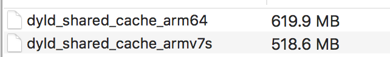

# dyld-extractior-lib
通过dyld加载动态库，并抽离出独立的动态库

## 介绍
- 环境介绍
越狱设备是iPhone 5S，系统为iOS 9。系统分析工具使用的是iFunBox,反编译工具是Hopper Disassembler v4，代码查看工具是Xcode 9.4 

- 我们知道苹果为了方便程序员开发，提供了很多封装好的动态库，比如UIKit、AVFoundation、ImageIO等，从iOS3.1开始，为了提高性能，绝大部分的系统动态库都会被打包到一个缓存文件中。这样所有的应用程序都共享一份动态库的缓存。
- 查看动态库的路径/System/Library/Caches/com.apple.dyld/

### dyld
- 在Mac/iOS中，使用/usr/lib/dyld程序来加载动态库，